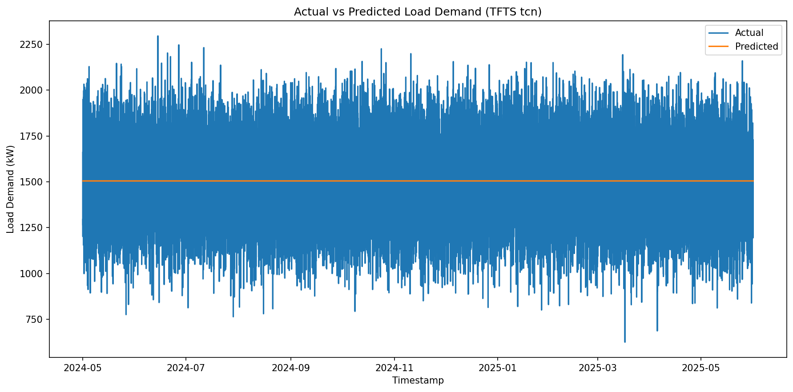
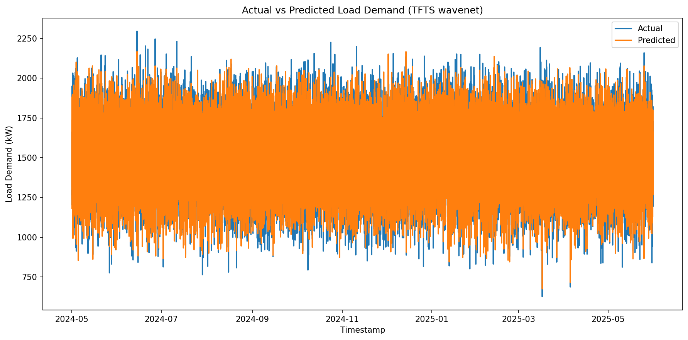
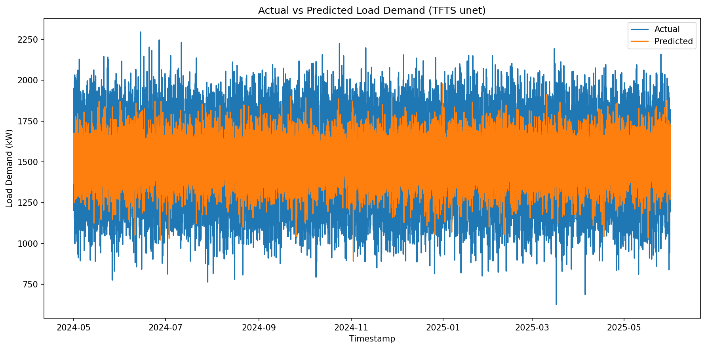
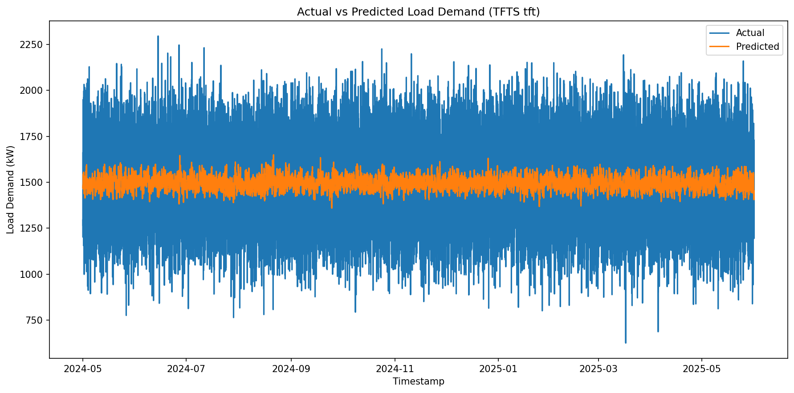
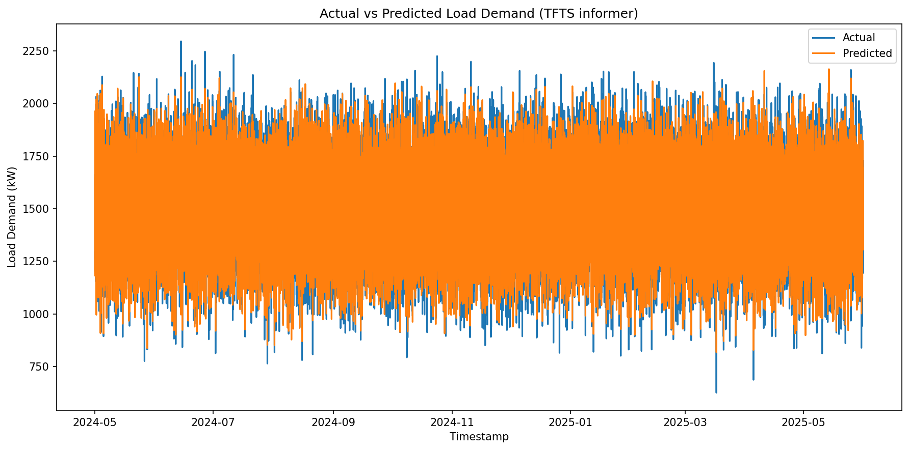
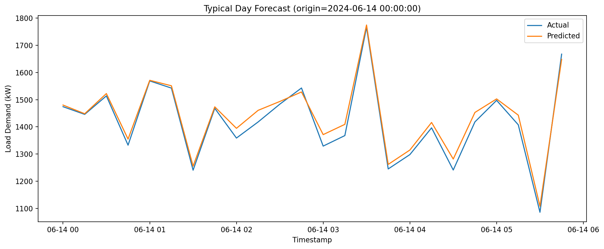
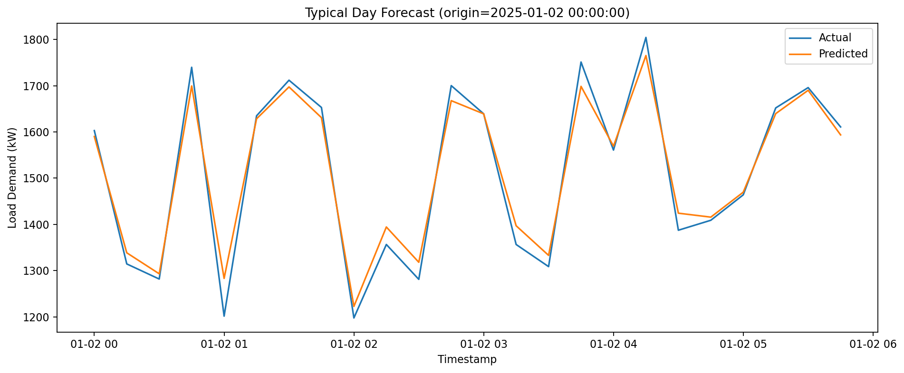
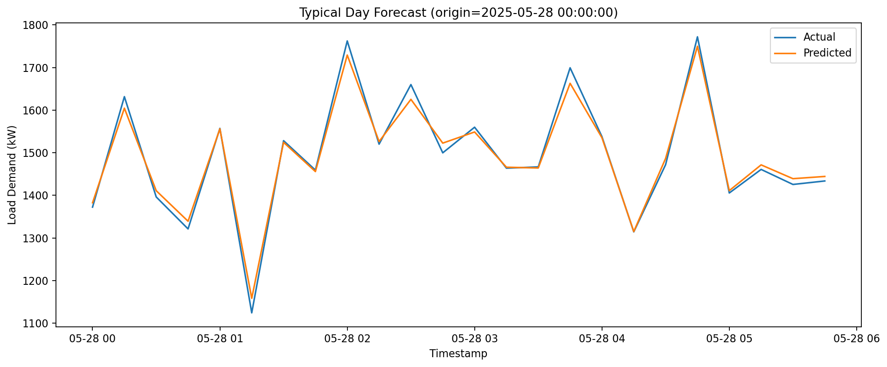

# Electric-Load-Forecasting

## 1 Current Algorithm

### RNN

**RMSE**: 200.3891
**MAPE**: 11.0782%

### TCN

**RMSE**: 199.5089
**MAPE**: 11.0325%

### WaveNet

**RMSE**: 88.1781
**MAPE**: 4.8761%

### UNet

**RMSE**: 216.2911
**MAPE**: 11.8973%

### Transformer

**RMSE**: 199.4722
**MAPE**: 11.0150%

### Bert

**RMSE**: 199.5089
**MAPE**: 11.0325%

### TFT

**RMSE**: 195.3225
**MAPE**: 10.8010%

### N-BEATS

**RMSE**: 199.4748
**MAPE**: 11.0240%

### Informer

**RMSE**: 79.1236
**MAPE**: 4.3754%

### Informer-Based Typical Days

