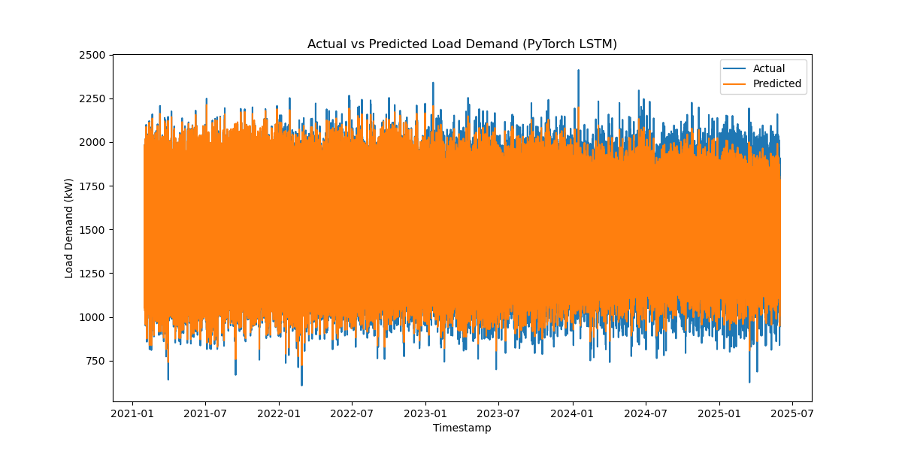
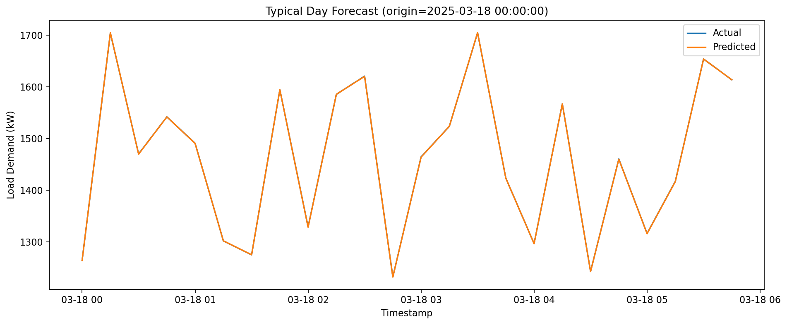
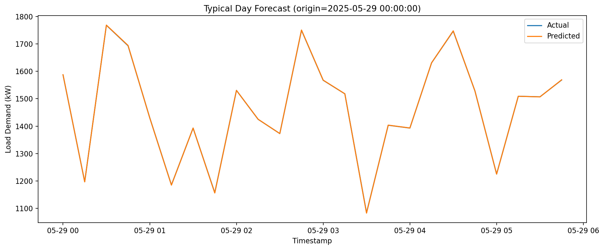

# Electric-Load-Forecasting

## 1 Current Algorithm

### LSTM

**Root Mean Squared Error (RMSE)**: 25.2153
**Mean Absolute Percentage Error (MAPE)**: 1.1892%

### EMD LSTM

**RMSE**: 1504.0463
**MAPE**: 99.4238%

### RNN

**RMSE**: 199.4952
**MAPE**: 11.0264%

### TCN

**RMSE**: 199.4927
**MAPE**: 11.0263%

### WaveNet

**RMSE**: 2.7076
**MAPE**: 0.1296%

### UNet

**RMSE**: 206.9925
**MAPE**: 11.4357%

### Transformer

**RMSE**: 199.4968
**MAPE**: 11.0361%

### Bert

**RMSE**: 199.4927
**MAPE**: 11.0263%

### TFT

**RMSE**: 45.8023
**MAPE**: 1.0788%

### N-BEATS

**RMSE**: 199.4800
**MAPE**: 11.0230%

### Informer

**RMSE**: 1.0744
**MAPE**: 0.0467%

### Informer-Based Typical Days

